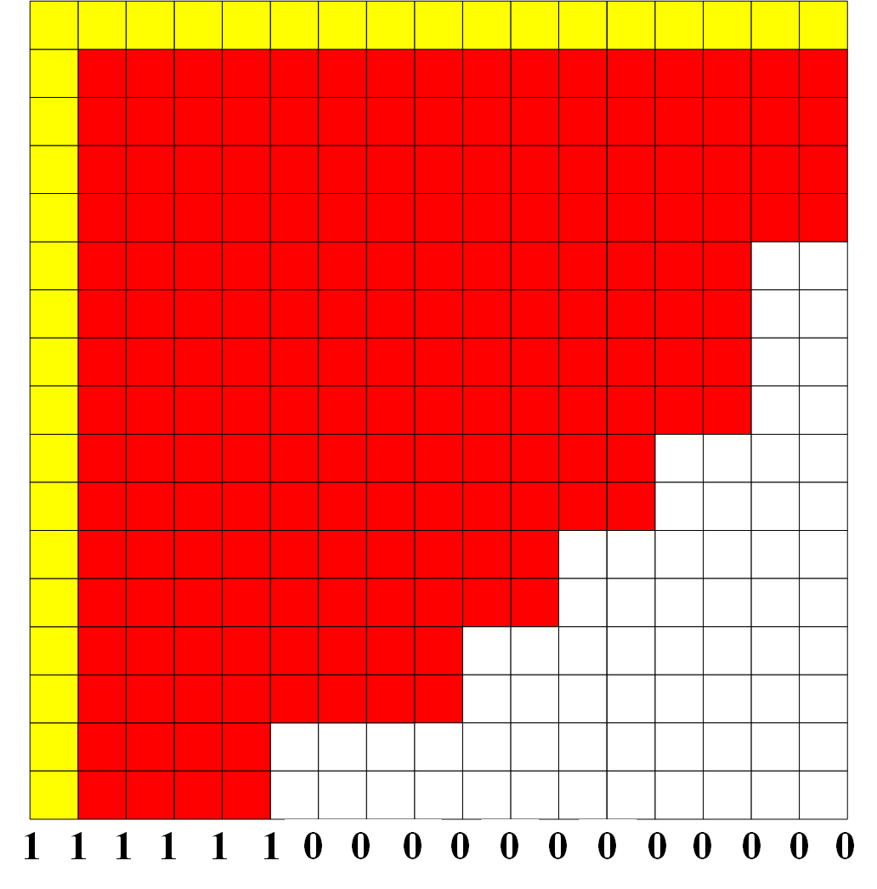

# %VTK Card

This card is considered to display the three dimensional physical output parameters by a visual method. Once %VTK card is defined, after running the case, a *.vtk file will be generated, and it can be dealt with the open source code ParaView.

Different from the definition of nodal geometry, %VTK card focus on each point of every node.

For example, the following figure is the discretized mesh of case NEACRP displayed by ParaView.


## %GEOM card of case NEACRP
```
%GEOM
9 9 18               !nx, ny, nz
10.803   8*21.606    !x-direction assembly size in cm
  1         8*2      !x-direction assembly divided 2x2
8*21.606 10.803      !y-direction assembly size in cm
  8*2       1        !y-direction assembly divided 2x2
30.  7.7  11.0  15.0  10*30.0  2*12.8  8.0  30. !z-direction size in cm (from bottom to top)
18*1                 !z-direction assembly divided into 20 cm each
3                    !np number of planar type
1  2  15*3  1        !planar assignment (from bottom to top)
! Planar_Reg 1
 1  1  1  1  1  1  1  1  2
 1  1  1  1  1  1  1  1  2
 1  1  1  1  1  1  1  3  2
 1  1  1  1  1  1  1  2  0
 1  1  1  1  1  1  3  2  0
 1  1  1  1  1  3  2  0  0
 1  1  1  1  3  2  0  0  0
 1  1  3  2  2  0  0  0  0
 2  2  2  0  0  0  0  0  0
! Planar_Reg 2
 4  5  4  5  4  5  4  6  2
 5  4  5  4  5  4  6  6  2
 4  5  4  5  4  5  6  3  2
 5  4  5  4  5  6  6  2  0
 4  5  4  5  4  6  3  2  0
 5  4  5  6  6  3  2  0  0
 4  6  6  6  3  2  0  0  0
 6  6  3  2  2  0  0  0  0
 2  2  2  0  0  0  0  0  0
! Planar_Reg 3
 4  9  4  9  4  7  4  6  2
 9  4  8  4  8  4 11  6  2
 4  8  4  8  4  8  6  3  2
 9  4  8  4  8 10  6  2  0
 4  8  4  8  4  6  3  2  0
 7  4  8 10  6  3  2  0  0
 4 11  6  6  3  2  0  0  0
 6  6  3  2  2  0  0  0  0
 2  2  2  0  0  0  0  0  0
! Boundary conditions (east), (west), (north), (south), (bottom), (top)
0 2 2 0 0 0
```

As described in %GEOM card, each node is divided into 2 parts in x and y directions except for the first node. Therefore, the actual node distribution of each planar for calculation is depicted as follows:



## How to define the %VTK card?

The %VTK card describes the points distribution on one planar which constitute the nodes and they have nothing to do with the material.

The basic rule to define %VTK card is if one point constitute a node, then the value is 1, otherwise, similar to %GEOM card, it is 0, as shown in above figure. For example, the %VTK card of case NEACRP is as follows:
```
1   1	1	1	1	1	1	1	1	1	1	1	1	1	1	1	1	1
1	1	1	1	1	1	1	1	1	1	1	1	1	1	1	1	1	1
1	1	1	1	1	1	1	1	1	1	1	1	1	1	1	1	1	1
1	1	1	1	1	1	1	1	1	1	1	1	1	1	1	1	1	1
1	1	1	1	1	1	1	1	1	1	1	1	1	1	1	1	1	1
1	1	1	1	1	1	1	1	1	1	1	1	1	1	1	1	1	1
1	1	1	1	1	1	1	1	1	1	1	1	1	1	1	1	0	0
1	1	1	1	1	1	1	1	1	1	1	1	1	1	1	1	0	0
1	1	1	1	1	1	1	1	1	1	1	1	1	1	1	1	0	0
1	1	1	1	1	1	1	1	1	1	1	1	1	1	1	1	0	0
1	1	1	1	1	1	1	1	1	1	1	1	1	1	0	0	0	0
1	1	1	1	1	1	1	1	1	1	1	1	1	1	0	0	0	0
1	1	1	1	1	1	1	1	1	1	1	1	0	0	0	0	0	0
1	1	1	1	1	1	1	1	1	1	1	1	0	0	0	0	0	0
1	1	1	1	1	1	1	1	1	1	0	0	0	0	0	0	0	0
1	1	1	1	1	1	1	1	1	1	0	0	0	0	0	0	0	0
1	1	1	1	1	1	0	0	0	0	0	0	0	0	0	0	0	0
1	1	1	1	1	1	0	0	0	0	0	0	0	0	0	0	0	0
```
## Example: Power distribution of Part 2 of MOX benchmark at full power


