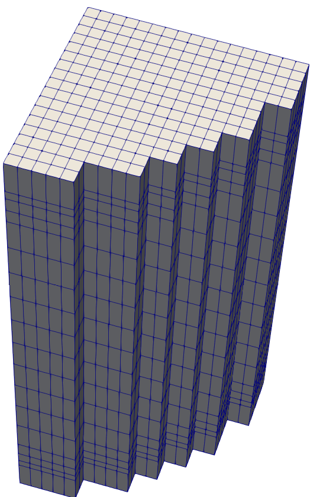
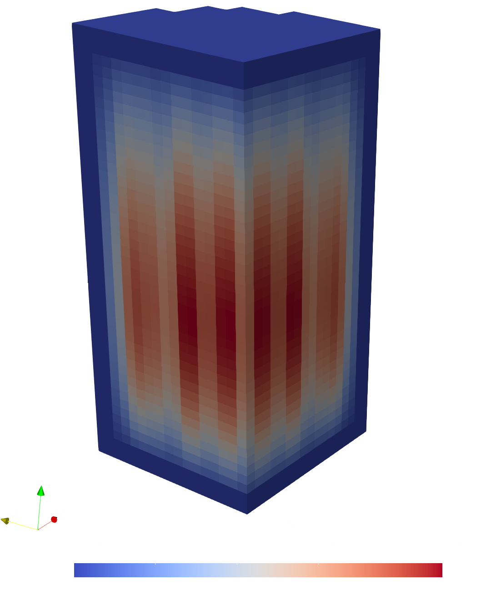
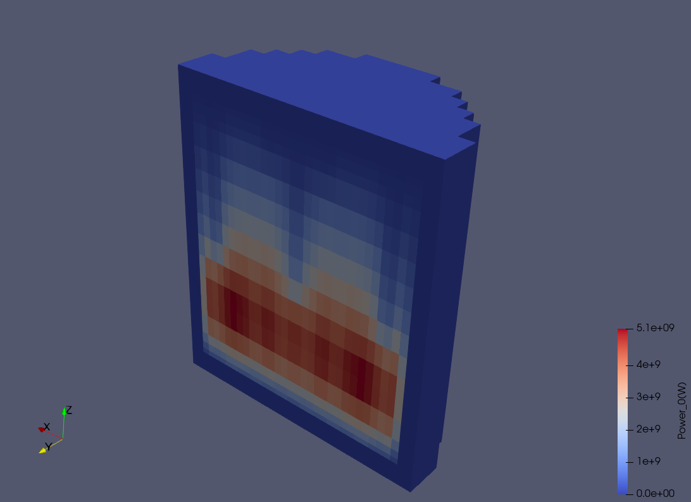

# %VTK Card

This card is used to generate a vtk file for visualisation in ParaView or other similar software.

| `%VTK` | Variable | Description | Available options |
| --- | --- | --- | --- |
| N/A | N/A | N/A | N/A |

Example:
```
%VTK
```
Some examples of visualized vtk files:






